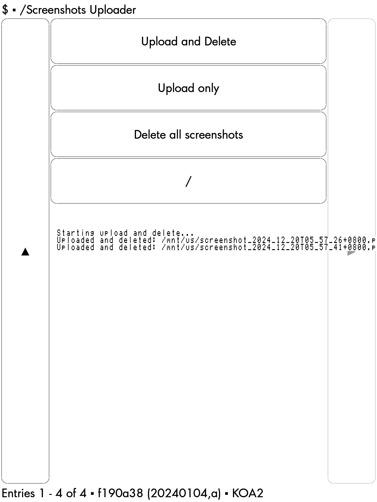
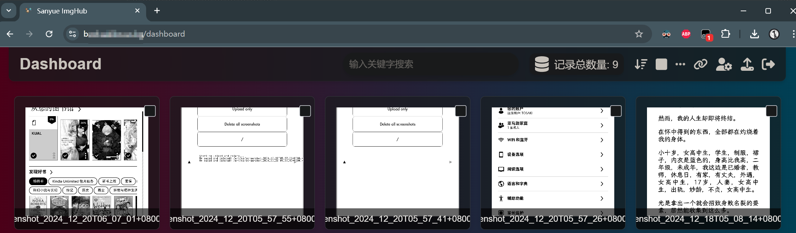

# Kindle Screenshots Uploader

A simple tool to upload your Kindle screenshots to an image hosting service, with options to manage your screenshots directly from your device.

## Features

- **Upload and Delete**: Automatically upload your screenshots and remove them from your Kindle.
- **Upload Only**: Upload screenshots without deleting them from your device.
- **Delete All Screenshots**: Remove all screenshots from your Kindle without uploading.

_All deletions also remove the corresponding `wininfo_*.txt` files._

## Screenshots





## Installation

1. **Jailbreak Your Kindle**:
   - Ensure your Kindle is jailbroken. If not, follow a reputable guide to jailbreak your specific Kindle model.
   
2. **Install KUAL (Kindle Unified Application Launcher)**:
   - Download and install [KUAL](https://wiki.mobileread.com/wiki/KUAL) on your jailbroken Kindle to manage extensions and custom applications.

3. **Download the Uploader**:
   - Clone or download this repository.
   - Locate the `kindle-ss-uploader` folder within the project.

4. **Copy to Extensions Folder**:
   - Connect your Kindle to your computer via USB.
   - Navigate to the `extensions` directory on your Kindle.
   - Copy the `kindle-ss-uploader` folder into the `extensions` directory.

## Configuration

Before using the uploader, you need to configure the upload URL and authentication code within the `upload_screenshots.sh` script:

```sh
UPLOAD_URL="https://your_image_hosting_service.com/upload"
AUTH_CODE="your_auth_code"
SCREENSHOT_DIR="/mnt/us"
```

- **UPLOAD_URL**: The endpoint of your image hosting service.
- **AUTH_CODE**: The authentication code required by your upload service.
- **SCREENSHOT_DIR**: The directory where Kindle stores screenshots (Typically `/mnt/us`).

**Important**: Since this tool uses a self-hosted image hosting service, you need to set up your own image hosting server and provide the corresponding `UPLOAD_URL` and `AUTH_CODE` in the script. Depending on your server's API requirements, you may need to modify the `curl` command in the `upload_file` function to match the expected format.

I'm self-hosting a free and open-source Cloudflare Pages site based on [CloudFlare-ImgBed](https://github.com/MarSeventh/CloudFlare-ImgBed) for my image hosting service. You can set up your own instance or use any other image hosting service that supports direct image uploads via API.

## License

This project is licensed under the [MIT License](LICENSE).

## Acknowledgements

- Thanks to the [KUAL community](https://wiki.mobileread.com/wiki/KUAL) for their invaluable resources and support.
- Inspired by various Kindle customization tools available on MobileRead forums.

---

*Happy screenshotting!*
