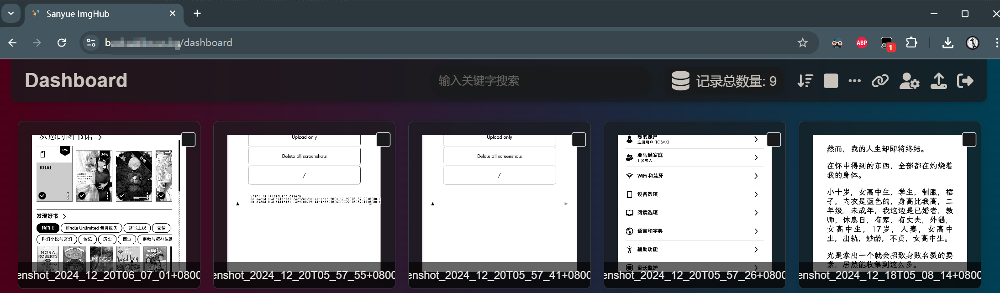

# Kindle 截图上传工具

[English](readme.md) | [简体中文](readme_zh.md)

一个简单的工具，可以直接从 Kindle 设备将您的截图上传到 WebDAV 服务器或图片托管服务。

## 功能

- **Upload and Delete**：自动上传您的截图并从 Kindle 中删除它们。
- **Upload Only**：上传截图而不从设备中删除它们。
- **Delete All Screenshots**：从 Kindle 中删除所有截图而不进行上传。

_所有删除操作也会删除相应的 `wininfo_*.txt` 文件。_

## 截图




## 安装

1. **越狱您的 Kindle**：
   - 确保您的 Kindle 已经越狱。如果没有，请按照可信的指南对您的特定 Kindle 型号进行越狱。

2. **安装 KUAL（Kindle Unified Application Launcher）**：
   - 下载并安装 [KUAL](https://wiki.mobileread.com/wiki/KUAL) 到您的越狱 Kindle 上，以管理扩展和自定义应用程序。

3. **下载上传工具**：
   - 克隆或下载此仓库。
   - 在项目中找到 `kindle-ss-uploader` 文件夹。

4. **复制到扩展文件夹**：
   - 通过 USB 将 Kindle 连接到您的电脑。
   - 导航到 Kindle 上的 `extensions` 目录。
   - 将 `kindle-ss-uploader` 文件夹复制到 `extensions` 目录中。

## 配置

在使用上传工具之前，您需要根据您选择的上传方法（WebDAV 或图片托管服务）在 `upload_screenshots.sh` 脚本中配置上传 URL 和认证代码。

### WebDAV 服务器

如果您没有图片托管服务，推荐使用 WebDAV 方法。

```sh
USE_WEBDAV=1

# WebDAV settings
WEBDAV_URL="https://webdav.hostname:[port]/path"
USERNAME="webdav_user"
PASSWORD="webdav_password"
```

- **USE_WEBDAV**：设置为 `1` 以使用 WebDAV 服务器上传截图。
- **WEBDAV_URL**：您的 WebDAV 服务器的 URL。
- **USERNAME**：您的 WebDAV 服务器用户名。
- **PASSWORD**：您的 WebDAV 服务器密码。

### 图片托管服务

```sh
# Image hosting service settings
UPLOAD_URL="https://some_img_hosting.com/upload"
AUTH_CODE="some_auth_code"
```

- **USE_WEBDAV**：设置为 `0` 以使用图片托管服务上传截图。
- **UPLOAD_URL**：您的图片托管服务的端点。
- **AUTH_CODE**：上传服务所需的认证代码。
- **SCREENSHOT_DIR**：Kindle 存储截图的目录（通常为 `/mnt/us`）。

    **重要**：由于此工具使用自托管的图片托管服务，您需要设置自己的图片托管服务器，并在脚本中提供相应的 `UPLOAD_URL` 和 `AUTH_CODE`。根据您的服务器 API 要求，您可能需要修改 `upload_file` 函数中的 `curl` 命令以匹配预期的格式。

    我使用了基于 [CloudFlare-ImgBed](https://github.com/MarSeventh/CloudFlare-ImgBed) 的 [Cloudflare Pages](https://pages.cloudflare.com/) 网站来自托管一个免费且开源的图片托管服务。您可以设置自己的实例，或使用任何其他支持通过 API 直接上传图片的图片托管服务。

## 许可证

本项目采用 [MIT 许可证](LICENSE) 进行许可。

## 鸣谢

- 感谢 [KUAL 社区](https://wiki.mobileread.com/wiki/KUAL) 提供的宝贵资源和支持。
- 灵感来源于 MobileRead 论坛上各种 Kindle 定制工具。

---

*截图愉快！*